Forza Analytics is a POC C# WPF Application that reads data from the 'Data Out' option in Forza Motorsport. it displays information pertaining to Raw Live figures such as Acceleration, Brake application, RPMs, and also values such as Lap Time breakdowns and map positions.

**THIS IS A POC AND WIP AND MAYBE BUGGY OR BEHAVE UNPREDICTABLY IN SOME SCENARIOS!**

To get started, build the solution and edit the configuration files according to your IP/Port setup in Forza. **This tool specfically uses the DASH format**.

- The 'Start' open starts listening to the selected IP/Port (changing this requires app restart). Stopping this will prevent further data being received.
- 'Reset All' will clear out all open pages/windows in the even of high memory consumption, or a session/event has changed.
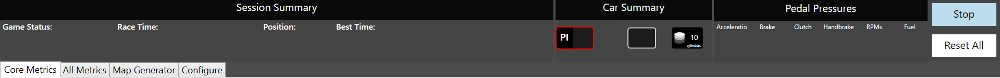

There are two main areas to the application: Lap Time data and the Map.

## Lap Time Data
Lap Time data should show information pertaining to the current session. Lap info is automatically tracked as the car goes around the circuit. however it is dependant on data picked up during play. pausing tracking and resuming between lap times _will_ cause unpredictable behaviour as it depends on live and previous information. 
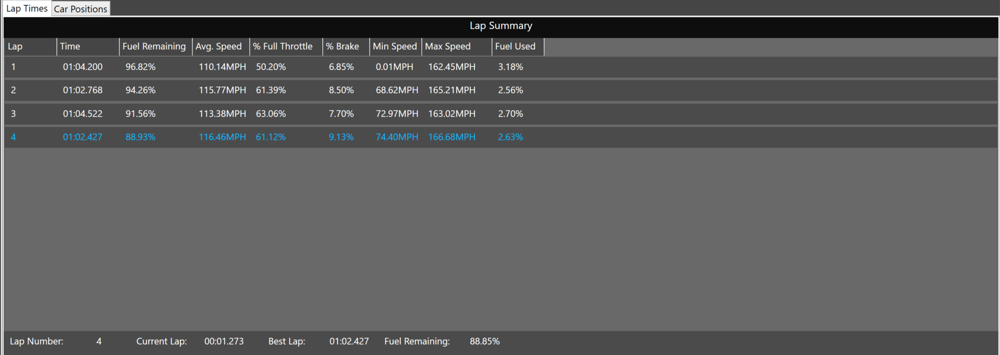

- The Car Positioning/Map is effectively two areas: the 'Map Generator' and the 'Car Positions' (under 'Core Metrics').
The Map Generator exists as a way for you to create your own maps. T10 does not currently provide geometry data for circuits so this is a way around plotting it manually.

## Plotting a Map
There is little point in using the 'Car Positions' pane without an associated map. and i have included _some_ in the solution. Note that the telemetry data does not include track names (or car names) but does return Ids representing a unique layout Id.

if you already have a map file (or are using an existingly plotted track you can skip this step)

1 - Open the Application and navigate to Map Generator via the Tab Group Control.

Start a 'Test Drive' session in a car that you can handle reasonably on the track of your choosing. **Its important to choose a car that handles well and smoothly because the route you drive will form the map** a car you can handle less or moves less predicably will cause an 'skittish' map through constant course corrections. for the same reason, set the **weather to clear**. this can take a few minutes to plot both sides so you dont want any reason to have to start over.

2 - complete a full lap or at least pass the Start line for the first time. then drive back to the start line and choose either the left or right side of the track limit. you should be like below in Game:
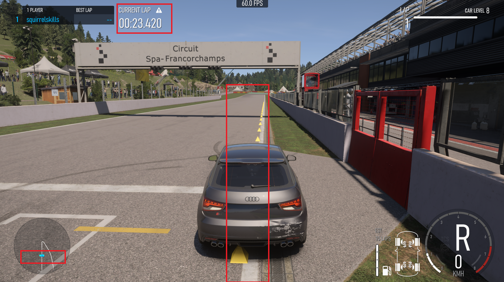
note the following points:
- lap has just started as i have crossed the start line
- positioned on the starting line
- positioned to one side of the track limits

3 - Optional (Set 'Map Scale' To 50%')  this is optional because when you start plotting you don't know what the default coordinates are, as you drive the map may show _no_ information  because its drawing lines outside the current view. changing to 50% shows more information so you can hopefully find where it is drawing.

4 - hit start tracking on the Map generator and drive around the circuit against the chosen side

> Note: when you start tracking, it will **automatically** stop tracking when you pass the start line on completion of the map. this is intentional.

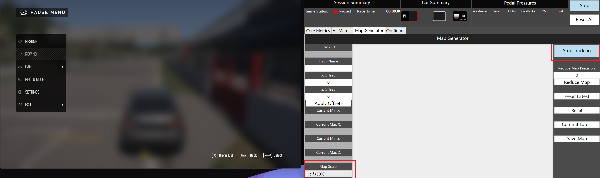

As mentioned before, you may notice no lines being drawn as you drive around initially. you may need to pan around in the white area to find the line points being drawn. any panning will updae the 'X and Z Offet' fields (you can also set this manually if necessary). its best to drive a few seconds, pause and pan to find the line(s) drawn. due to the nature of the Canvas property used to plot points, scrolling isnt _fully_ functional (yet. WIP!)

> Pan with **Right** Mouse Button, for whatever reason (current bug) left mouse down is not responding to drag actions#

Once you have found the drawn line(s). go back to game and complete a lap leaving it running in the background

5 - Once a lap is done, the app will automatically stop tracking.

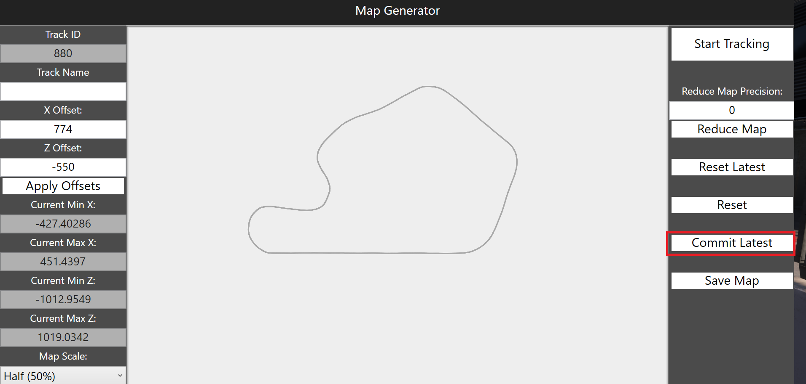
 Look at the app, confirm your happy with the layout, if so hit 'Commit Latest', this saves that layout to memory so you can start the next side.

 If at any point of the lap you mess up or lose control or perform a line your not happy with. hit 'Reset Latest', this will remove only the current (non-committed) positions

 > e.g. if you have already done one line but mess up the second line, reset latest will remove just the current line but leave the previous line.

 6 - move back to the start line on the opposite side/limit, hit 'Start Tracking' and perform another line.

 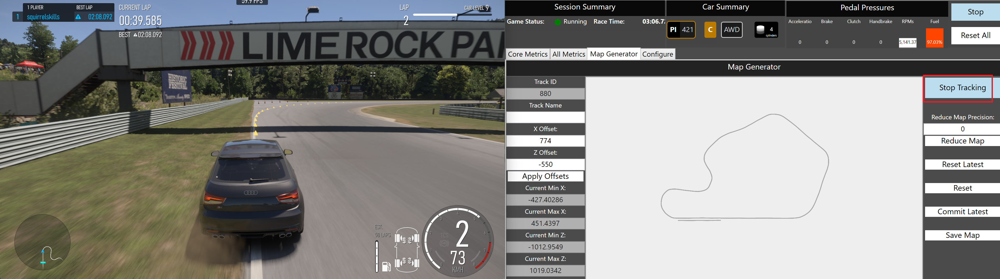

 7 - once finished both sides and you're happy, hit 'Commit Latest' and then 'Save Map'
 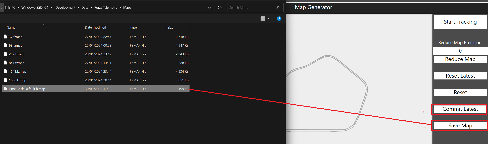
 Maps are saved as .fzmap. it is just JSON but another extension so that we dont mix telemetry with map data for cleanliness.

notes:
Reduce Map is a means of reducing the file size and precision. because xyz coordinaes are stored as floats, and are tracked at 60x per second per movement of the car, it can often be too granular. i would for the most part leave this as it is. we can have the map file be crazy precise and it can instead be reduced on load in the 'Car positions' tab.

## Loading a map and tracking positions
 1 - Navigate to the 'Core Metrics' and then 'Car Positions'

 2 - Click 'Load Map' and select the map relevant to the current track. This will load the map as a filled polygon (see below)
 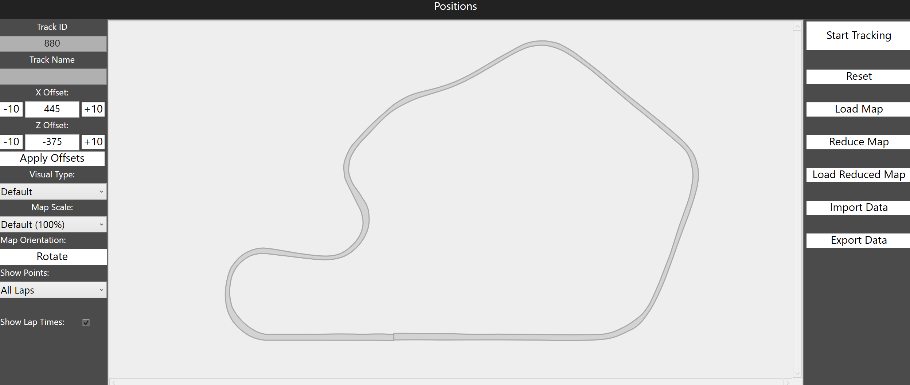

 **Optional**: Reduce the map. this helps save memory and track points though does have an impact on how 'smooth' the map is:

Left Shows Normal Load, Right shows how it loads reduced. notice how left is more smooth but takes up more points...
 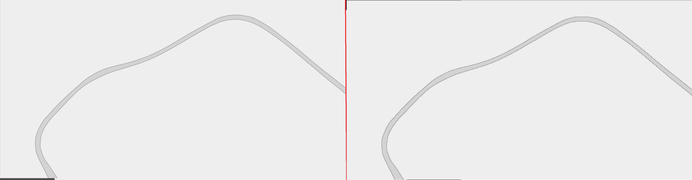

 'Load Reduced Map' loads the map and automatically reduces it, handy to skip the step if you know you dont need to zoom in or have that level of precision.

 > Note: Reducing the map does not alter the map file, it only rounds off and loads distinct positions at a lessened precision to save memory.

3 - Click 'Start Tracking'
the map will update with positions on top as you drive.
 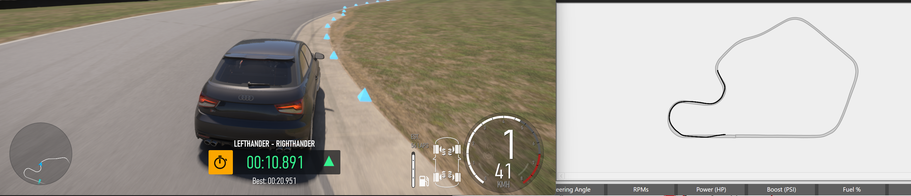

you can change orientation, the visual type and the lap points etc to show as during operation if you please. the map should update accordingly.

>Note: tracking points is quite memory intensive. its recommended to change the 'Show Points' to 'Current Lap', this will reset the visual per map. the telemetry for previous maps will be retained during the run, but it limits how much is shown on the front end.

# Saving and Loading Telemetry Data
When you have tracked data from the Car Positions, you can export the data to a JSON file. it currently stores it as '.fztel' again so we can distinguish between map and telemetry, though it is just JSON and can be opened in notepad, VS Code, or any tool like Power BI etc.

You can load telemetry without needing Forza Motorsport open, and without needing tracking.

if you had it open or a previous session, hit 'Reset', otherwise load the map file and then hit 'Import Data'.

this will open the telemtry file and replot the positions on the map aligned, you can interact with this as you would when Forza was running - changing the zoom/rotation/visual type etc.

So long as the map files are shared, the telemetry data can be shared with others who have the application to load/preview.

# Replaying Telemetry Data
Loaded data can be reloaded, data is served via Forza Motorsports 60x per second meaning we can infer a timeframe for data being displayed. the timeframes are an approximation due to any potential delays in reading, loading and displaying the data.
On loading Telemetry, the 'Replay' button becomes active:
 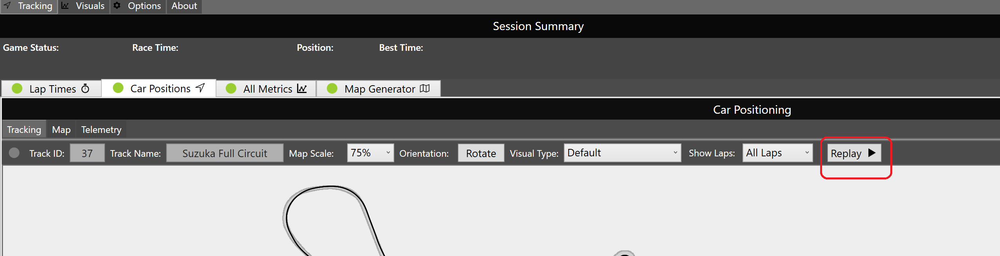

On replay a new metrics bar will appear that will show any telemetry data relating to that point as well as updating the chart with the positional data.
this data relates to acceleration, speed, gear and so on as per normal tracking.
chart metrics can be changed during this and reload will continue.
 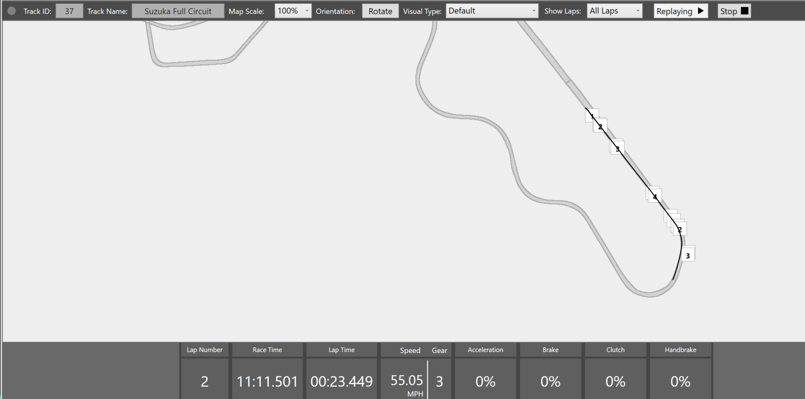